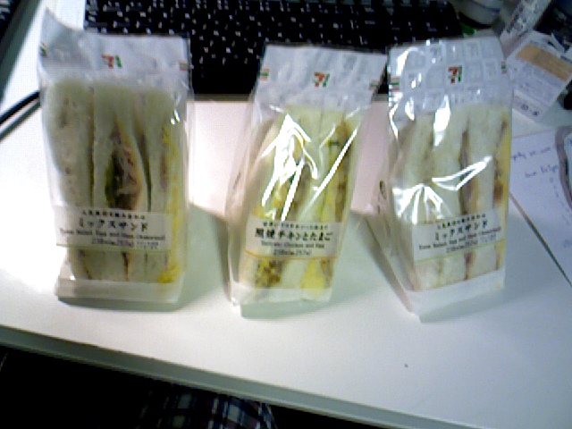
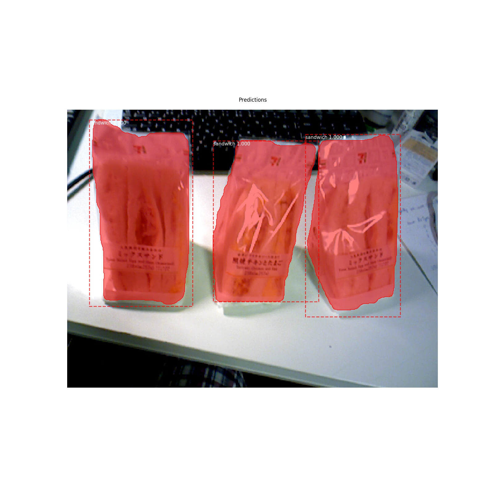

Ongoing project to segment sandwiches and other food at convenience store for robot manipulation

============================
## Preparation
 * install requirements
 * run ./sh/preparation.sh to download models

## How to
 * This package provides a service to get the instance masks of the sandwiches.
   - roslaunch fcsc run\_fcsc\_sandwich.launch
   - python scripts/fcsc\_sandwich\_client.py

 * When you run the program on jetson board, loading model weights and running client script for the first time will take a little time. But afterwards the client scripts will run faster. So the stategy might be: launch the service, run the client code with dummy data when starting up the robot.

 * Writing another service to get the pose of the object from point cloud with PCA

## Sample Images

   

    
   

   

    
   

